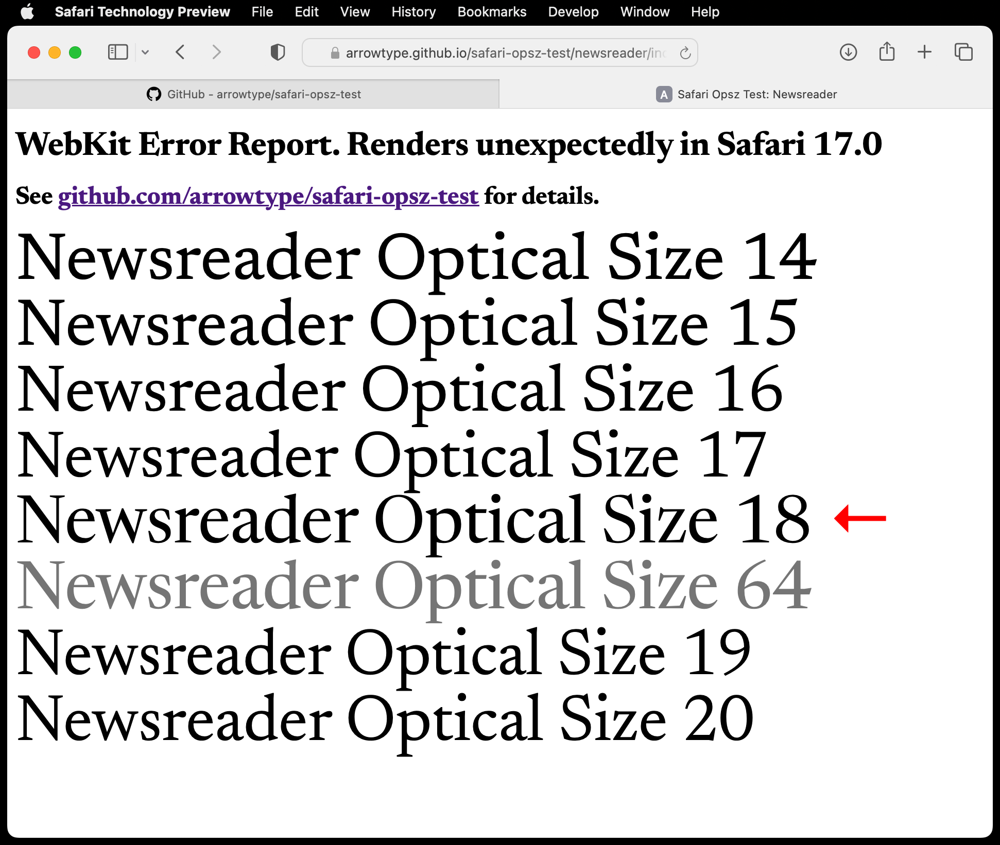

# Safari Optical Size Error Report

GitHub repo for a WebKit/Safari Error Report: https://bugs.webkit.org/show_bug.cgi?id=258944

See https://arrowtype.github.io/safari-opsz-test for a live browser test.

In Safari Technology Preview (Release 173 (Safari 17.0, WebKit 18616.1.20.2)):
- In a variable font with an Optical Size (`opsz`) axis and Weight (`wght`) axis
- If the `wght` and `opsz` axes are at their defaults (often, `wght=400` and `opsz` somewhere between about `8` and `20`)

...The `opsz` that gets *rendered* is the font’s current px size – even if `font-variation-settings` is specifying a specific `opsz` that isn’t the current px size. 

This is a problem because it violates the purpose of `font-variation-settings` as providing low-level control over variable font styles, as is [specified in the CSS Fonts Module Level 4]([url](https://drafts.csswg.org/css-fonts/#font-variation-settings-def)).

This is tested in Roboto Flex, Roboto Serif, Newsreader, Fraunces, and other variable fonts with `wght` & `opsz` axes.

Another simple way to test this is to load such font into [Wakamai Fondue](https://wakamaifondue.com/beta/). It has type testers that are set to the font’s defaults.

Please note: in the current main Safari, there are other `opsz` inconsistencies. For example, if you go to a font’s max `opsz`, the rendered font weight will suddenly be the min `wght`. So, please test for that while fixing this, and don’t e.g. simply revert changes to opsz handling (not that I think you would do so, but there have been problems here for awhile, so please be careful but also quick, if possible, in addressing it).

WebKit folks: thanks so much for all your work here!

## A workaround for web authors

This issue should be fixed, but until it is, it seems that adding `font-optical-sizing: none;` along with the `font-variation-settings` will allow the `opsz` to be specifically set, even for its default value.

## Screenshots

